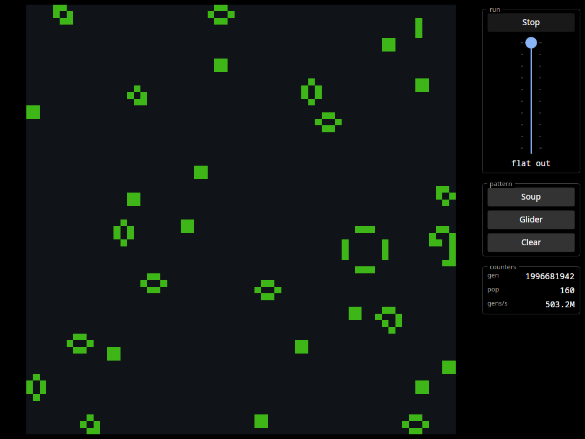

# Warp 11

**An F# HDL that runs on real FPGAs.** Describe hardware in F#, step it in a
cycle-accurate debugger, emit Verilog, and put it on silicon — then drive it
from a Rust runtime over AXI. The same source elaborates the simulator and the
bitstream, so what you debug is what you deploy.

*A desktop application rendering Game of Life out of the fabric of a KV260:
64×64, **503 million generations per second**, 2 billion generations in. The
blocks and blinkers are what a random soup settles into after that many — at
this rate it gets there in the first few microseconds.*



- **Simulate the whole application, host side included.** The same driver code
  runs against the simulator and against the board, so the program and the
  hardware can be tested together before either reaches silicon. The simulator
  itself is checked against Verilator on the emitted Verilog, cycle by cycle,
  across every design in the library.
- **A step-through debugger.** Watch lists, memory windows, waveforms, and
  breakpoints written as expressions over your own signals — attachable to a
  design an application is already running, and extensible with your own panels,
  because what you actually want to look at is specific to what you built. VCD
  export when you want GTKWave's zoom, search and cursors instead.
- **Board and host integration as a first-class concern.** One register-map
  definition emits the AXI slave *and* the host driver's constants, so the
  program and the fabric cannot disagree about the register map.
- **Scaling is a number you change.** Going from four parallel workers to a
  hundred is editing one number: the stages wire themselves up, back-pressure is
  handled for you, and the counters that say which stage is starving read the
  same in simulation and on the board.
- **Whole classes of bug unrepresentable.** One driver per signal, one
  declaration per name, width checks gating emission, streams consumed exactly
  once, a memory declaring whether it is block or distributed so a
  combinational read of the wrong one cannot elaborate — each from a real bug
  that was legal Verilog, and therefore invisible to every tool downstream.

> **Status: pre-release.** Everything described here runs today, but the API is
> not stable and there is no published package yet. See
> [what is not built](#what-is-not-built).

## Try it without installing anything

The debugger runs in a browser. Pick a design, poke an input, press **Run**, and
watch the registers move — no toolchain, no board, no account. It is a place to
learn the mechanisms rather than a workbench; real simulation happens in the
desktop build, which is a great deal faster.

**[▶ Open the tutorial in your browser](https://warp11.org/try/)**

## What it looks like

A counter, in the Warp 11 DSL:

```fsharp
let counter =
    design "Counter" (fun () ->
        let enable = inputBit "enable"
        let clear = inputBit "clear"
        let count = output "count" 8
        let r = reg "r" 8

        If clear (fun () -> 0UL ==> r)
        Else (fun () -> If enable (fun () -> r + 1UL ==> r))

        r ==> count)
```

`emitVerilog counter` produces:

```verilog
module Counter (input clk, input rst, input enable, input clear, output [7:0] count);
    reg [7:0] r;
    assign count = r;
    always @(posedge clk) begin
        if (rst) begin
            r <= 8'd0;
        end else begin
            r <= (clear ? 8'd0 : (enable ? (r + 8'd1) : r));
        end
    end
endmodule
```

That is the whole story in miniature: ordinary F# runs at **elaboration** time
and leaves a circuit behind. Loops, folds, recursion and higher-order functions
are all available, and none of them exist at run time — a `for` loop that
creates four ports leaves four ports, not a loop.

## What it has done

Three accelerators run end to end on a Xilinx KV260 — F# elaborator → emitted
Verilog → Vivado bitstream → Rust driver over AXI:

- **Mandelbrot** — 1400×800 at 256 iterations in **4.30 ms of fabric time**
  (261 Mpx/s; 5.21 ms end to end), across 104 barrel-threaded lanes filling
  **100% of the board's 1,248 DSPs** at 166.67 MHz.
- **GEP** — a genetic-programming generation loop entirely in fabric,
  bit-exact against a software twin, **0.85 µs per offspring**.
- **Game of Life** — 64×64, whole grid updated in a single cycle, streamed to a
  host UI over a triple-buffered snapshot path.

None of those are demos written to look good in a README. Each has a software
twin it is checked against bit-for-bit, and the numbers are measured on the
board.

## Why it exists

Most HDL toolkits ask you to be a hardware engineer who tolerates a
general-purpose language. Warp 11 is aimed at a **software developer who wants
an accelerator** and is willing to learn what silicon actually demands — which
is a real amount, but far less than the tooling usually implies.

The honest comparison against Chisel, SpinalHDL, HardCaml, Amaranth, Clash,
Bluespec and Veryl — including where Warp 11 is behind — is in
[HDL_COMPARISON.md](docs/HDL_COMPARISON.md).

## Getting started

You need [.NET 10](https://dotnet.microsoft.com/download). Nothing else, until
you want a bitstream.

```sh
git clone https://github.com/warp-11/warp-11.git
cd warp-11/hdl/Warp11.Tutorial.App
dotnet run -c Release
```

That opens the tutorial: **34 designs**, from a counter to a register map and an
AXI master, each with a page explaining what it teaches and the source that
defines it, in a debugger you can step. Every page's claims are checked against
the design that makes them, so a page cannot drift from what the hardware does.

To check the toolchain against itself — the differential oracle, which needs
[Verilator](https://verilator.org). Every design is simulated, its emitted
Verilog is executed against a generated testbench asserting that exact trace,
and any divergence fails:

```sh
cd hdl && ./run_differential.sh

FIRTOOL_LEG=1 ./run_differential.sh   # adds the firtool leg; roughly doubles it
```

`firtool` is never a dependency for using Warp 11 — it is how the claim that
the IR did not invent its own semantics gets measured.

## Where to go next

**Getting started, in order:**

- **[How it fits together](docs/architecture.md)** — the map. What elaboration
  is, what the simulator and the Verilog emitter each do with it, and where the
  Rust runtime sits. Start here if you have not used an HDL before.
- **[Start your own project](docs/start-a-project.md)** — an empty folder to a
  design of yours running in the step-through debugger. No FPGA required.
- **[Drive it from Rust](docs/drive-it-from-rust.md)** — give it a register map
  and a host program, still running against the simulator.

**Then, in any order:**

- **[The tutorial](hdl/Warp11.Tutorial/doc/counter.md)** — start at Counter and
  read through Sequencer, which is the first tier and enough to build something.
  Streams, the stdlib and the board-facing pages follow. It assumes you can
  program and does not assume you have written RTL.
- **[Streams](docs/streams.md)** — the ready/valid layer, and `wormhole`, the
  one call that connects anything stream-shaped.
- **The examples** — [Mandelbrot](hdl/Warp11.Mandelbrot/README.md),
  [GEP](hdl/Warp11.Gep/README.md) and
  [Game of Life](hdl/Warp11.GoL/README.md), each with its own write-up.
- **[Runtime and host drivers](runtime/README.md)** — the crates, cross-compiling
  for the board without a cross-gcc, and the first-light binaries.
- **[Hardware workflow](docs/dev-workflow.md)** — getting a bitstream onto a
  KV260 and driving it.

## What is not built

Being clear about this is cheaper than letting you find out:

- **No published package.** You clone the repo. NuGet is planned.
- **The API is not stable.** It is pre-1.0 and things move.
- **Limited hardware support.** One board is proven — a Xilinx KV260 — and
  while nothing about the toolkit is KV260-specific, nothing else has been run.
  What you can plug it into is short to match: AXI4-Lite from a register map,
  AXI4 master read and write, and I2S in and out is the whole list, where the
  established libraries ship half a dozen bus families and a shelf of
  controllers. That is about the hardware edges rather than the library as a
  whole — the audio chain and the stream connect layer are deep.
- **No formal verification, no multi-clock/CDC support.**

## License

[Apache License 2.0](https://github.com/warp-11/warp-11/blob/main/LICENSE).
