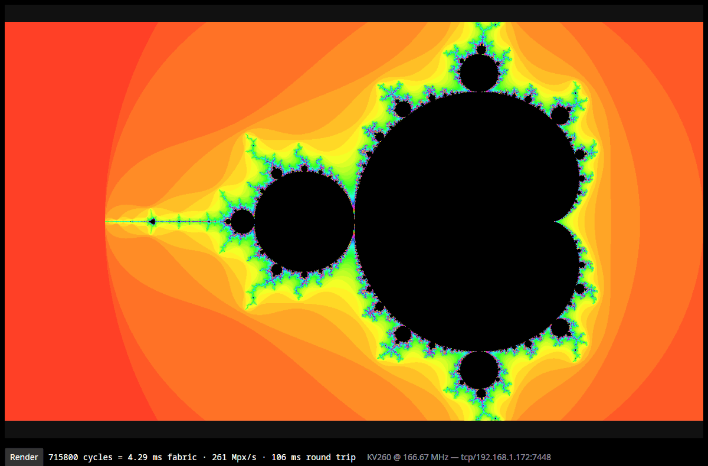

# Mandelbrot

A Mandelbrot renderer that fills every DSP on a KV260. 1400×800 at 256
iterations, **4.30 ms of fabric time** — 261 Mpx/s — with 104 lanes at
166.67 MHz, and the framebuffer streamed straight into PS DDR.

On the [sql-mandelbrot-benchmark][bench] view that is **128× a vectorized
numpy and 262× DuckDB on an M4 Max**, end to end, from a $300 board — and
5.6× behind the same laptop's Metal GPU on a kernel-only best-of-N with no
readback. [The full field, and what each timer
wraps](#against-other-implementations-of-the-same-workload).

*Status: on silicon, bit-exact against the software twin.*

*`Warp11.MandelView` showing a frame the fabric just rendered, with the fabric's
own cycle count beside the round trip. The 106 ms is the host asking, waiting,
and pulling 1.1 MB back over the network — the render itself is the 4.29 ms.*



## The shape of it

The interesting part is not the fractal, it is the lane. A Mandelbrot pixel
takes an unpredictable number of iterations — some escape after two, some run
the full 256 — so a fixed pipeline stalls on the slow ones and a naive parallel
array idles on the fast ones.

The answer here is a **barrel-threaded lane**: one arithmetic pipeline shared by
16 pixels in flight, one advancing per cycle in rotation. The multiplier is busy
every cycle regardless of how the pixels are behaving, because there is always
some other pixel ready to advance. When a pixel escapes, its slot is refilled
from the next row without disturbing the others.

That makes the design DSP-bound rather than control-bound, which is why it
scales until the board runs out of DSPs — and it does exactly that, at 104
lanes using all 1,248 of them.

```
MandelFrame            the frame walker: which rows, which pixels, when to stop
  └── MandelPod        104 lanes plus the coalescer
        ├── MandelBarrelLane × 104     16 pixels in flight each
        └── MandelRowCoalescer         16 pixels per 128-bit beat
              └── AXI master → PS DDR
```

**Coalescing is not an optimization, it is the reason the design is possible.**
A single-beat AXI write per pixel caps out around 25 Mpx/s — an order of
magnitude below what the lanes produce. Sixteen pixels per 128-bit beat is what
lets the fabric keep up with itself.

## Running it

In simulation, no board required:

```sh
cd hdl
dotnet run -c Release --project Warp11.Mandelbrot            # the living checks
```

Emit the Verilog and the register map the driver uses:

```sh
dotnet run -c Release --project Warp11.Mandelbrot -- hardware <repo-root>
```

That writes both accelerators and both seams in one pass:
`hardware/build/MandelPodAxi.v` with `mandel_layout.rs`, and
`hardware/build/MandelFrameAxi.v` with `mandel_frame_layout.rs`.
**Each pair comes from the same definition** —
the register map is not maintained by hand, which is why the host and the
fabric cannot disagree about what offset the iteration count lives at.

Then the bitstream, and the board:

```sh
cd hardware/vivado && vivado -mode batch -source build_mandelfs_axi.tcl
# on the board
xmutil unloadapp && xmutil loadapp mandel-fs
mandel_first_light
```

**Two apps, and the numbers below are the second one.** `mandel-fs` is the
one-shot pod; `mandel-frame` is the re-renderable frame accelerator — same
104 lanes, but it latches a view per render, so a host can ask for another
without reloading anything. That is the one the daemon and the live view
drive, and its first light is `mandel_frame_first_light` after
`xmutil loadapp mandel-frame`.

See [docs/dev-workflow.md](../../docs/dev-workflow.md) for the deploy path.

## Files

- `Step.fs`, `Lane.fs` — one iteration, and the barrel-threaded lane around it
- `Coalescer.fs` — 16 pixels into a 128-bit beat
- `Pod.fs`, `LanePod.fs`, `FramePod.fs` — the mini pod, the lane pod, and the
  decomposed frame renderer the silicon build uses
- `FrameAxi.fs`, `Seam.fs` — the AXI slave and the generated register map
- `Host.fs`, `FrameHost.fs` — the software twins, the PPM renders, the
  `simserve`/`frameserve` bridges the Rust driver runs against
- `Main.fs` — checks, `hardware`, the simulation probes

## Numbers, and where they come from

All measured on the board, `mandel_frame_first_light` at the
default view (the whole set, 1400×800, 256 iterations). Nothing here is
projected.

### The render

| | |
|---|---|
| fabric | **715,938 cycles = 4.296 ms** — 261 Mpx/s |
| clock | 166.67 MHz, 104 lanes, 1,248 DSPs, WNS positive after route |
| host wall, incl. polling | 7.16 ms |
| correctness | **0 mismatches of 1,126,400 bytes** against the software twin |

Rendered twice in the same run, both 715,938 cycles exactly — the pod is
re-renderable and its cost does not depend on what came before.

### Getting the frame back, three ways

The framebuffer is 1.1 MB in PS DDR, and how you read it matters more than
it looks. Same bytes, same run, three mappings:

| path | time | rate |
|---|---|---|
| uncached, `O_SYNC` mmap | 10.24 ms | 110 MB/s |
| cached mmap + `sync_for_cpu`, cold | 2.47 ms | 456 MB/s |
| cached mmap + `sync_for_cpu`, warm | **0.92 ms** | **1,230 MB/s** |
| cached, pure read (a `u64` sum, no stores) | 0.52 ms | 2,175 MB/s |

**The uncached path is 11× slower than the cached one**, which is why the
daemon uses the cached mapping and an explicit `sync_for_cpu` rather than
the always-correct `O_SYNC` baseline. The two are asserted byte-equal in
first light, so the fast path is checked rather than trusted. The pure-read
row separates the mapping's bandwidth from memcpy's character: about half
the warm copy's time is the store side, not the read.

So end to end, fabric plus readback:

| | |
|---|---|
| uncached | 14.54 ms |
| **cached + sync** | **5.21 ms** |

### Live, over the network

Through `mandel-daemon` and `Warp11.MandelView` (§ [MandelView](../Warp11.MandelView/README.md)):

| | |
|---|---|
| round trip, warm | **110–114 ms** |
| round trip, first frame | 110 ms (indistinguishable — the wire dominates either way) |
| on the wire | 1,120,000 bytes per frame, cropped from the padded 1408 stride |

**The wire is the bottleneck, not the fabric — roughly 25×.** A 4.3 ms render
moving 1.1 MB over TCP is a network benchmark with an accelerator attached,
which is worth knowing before anyone designs an interaction that assumes frames
are cheap to ship.

*Re-measured 2026-08-19, eight consecutive renders, 110–114 ms every time.
This table previously read 44 ms warm and 139 ms first-frame; neither
reproduces. The link is gigabit but measures ~13 MB/s board-to-host, and at
that rate the 1.12 MB frame alone accounts for ~87 ms of the round trip — so
today's number is consistent with the wire and the old one was not.*

*The page was already disagreeing with itself about this: the screenshot
caption at the top reads **106 ms**, which is what this path does. Only the
table said 44. A number that no longer reproduces is worse than no number, and
one that contradicts the picture directly above it should have been caught by
reading the page.*

### Against other implementations of the same workload

The [sql-mandelbrot-benchmark][bench] suite times CPU, SQL and GPU
implementations of *this exact view* — 1400×800, 256 iterations,
x∈[−2.5,1.0], y∈[−1.0,1.0] — on a **MacBook Pro M4 Max**. The detail that
decides whether a comparison is honest is **what each timer wraps**:

- **CPU / SQL** (numpy, Arrow, DuckDB, …): wall time around the whole call,
  **until the full iteration array exists in host RAM** — single run, end to
  end.
- **GPU (Metal)**: the kernel dispatch → `waitUntilCompleted` only —
  **best-of-N**, warm, buffer allocation and shader compilation excluded,
  **no readback**. The benchmark's own README calls it *"unfair, but the
  true limit."*

So there are two anchors, and each row is compared against the one that
matches it:

| | Implementation | Hardware | What's timed | Time | Warp factor † |
|---|---|---|---|---:|---:|
| — | **Warp 11 (this work)** | **KV260 (~$300)** | **end to end** (compute → DDR → host) | **5.21 ms** | 1× |
| — | Warp 11 (this work) | KV260 | fabric compute (frame in DDR) | 4.296 ms | 1× |
| 🏎 | Apple Metal GPU | M4 Max | GPU kernel only, best-of-N, no readback | 0.77 ms | 0.18× |
| 1 | NumPy (vectorized) | M4 Max CPU | end to end | 665 ms | **128×** |
| 2 | ArrowDatafusion SQL | M4 Max CPU | end to end | 797 ms | **153×** |
| 3 | DuckDB SQL | M4 Max CPU | end to end | 1,364 ms | **262×** |
| 6 | Pure Python | M4 Max CPU | end to end | 4,328 ms | **830×** |
| 7 | SQLite SQL | M4 Max CPU | end to end | 44,918 ms | **8,618×** |

† Benchmark time ÷ the *comparable* Warp 11 time — end-to-end for the
CPU/SQL field, fabric-compute for the GPU's kernel-only figure. Above 1×
means Warp 11 is faster.

**Against the fair field it wins by two orders of magnitude** — 128× numpy,
262× DuckDB, on a $300 embedded board against a top-tier laptop. **Against
the GPU's compute-only "true limit"** it is 5.6× behind, on a warm
best-of-N kernel with no data movement, on far more die, power and price.

Two honest caveats in the other direction. A bigger FPGA with more DSP and
HBM clears 0.77 ms outright — this part ran out of DSPs at 104 lanes, not
out of architecture. And at deep zoom, where you need more than FP64, the
GPU cannot compete at all while an FPGA just widens its fixed point.

### Number-format precision

The CPU/SQL benchmarks compute in **FP64** (the language default); the Metal
GPU in **FP32**. Warp 11 uses **Q4.28 signed fixed point** — 28 fractional
bits, which sits *between* FP32's 24 and FP64's 52. This is not a
lower-precision shortcut: at 256 iterations on this view all three formats
produce **identical escape counts everywhere**, so precision is not the
limit, iteration count is.

Q4.28 is the honest sweet spot rather than a compromise — it maps to one
DSP48-friendly 32×32 multiply and avoids the ~10× DSP cost of floating point
on FPGA. Matching FP64 exactly is a parameter widen to 64-bit fixed, the
FPGA's native move, not an IEEE-FP build.

### The gap that is left

The fabric time is 91.8% of the lane-limit ideal for this view. The
remaining ~8% is a row-boundary loss — tails and gathering drains — filed
rather than fixed.

One limit worth naming because it is not obvious from the numbers:
**`MAX_ITER` is fixed at 256 in the elaborated pod**, so zooming toward the
boundary saturates — every pixel hits the cap and the frame goes black.
That, not the Q4.28 coordinate format, is what bounds useful zoom depth, and
it is why the live view ships without one.

[bench]: https://github.com/Zeutschler/sql-mandelbrot-benchmark
